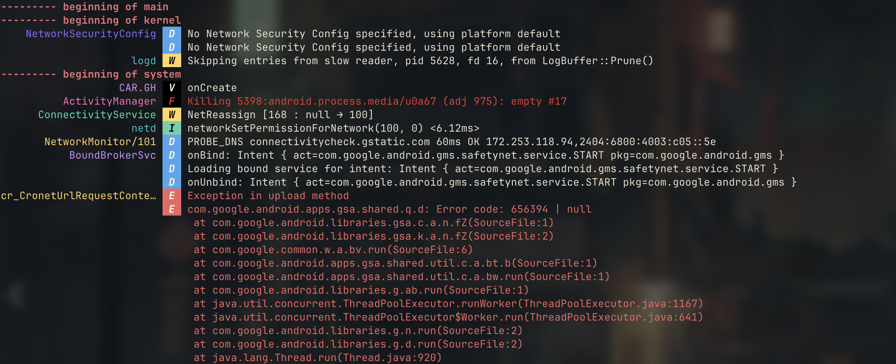

# 🐱 Gocat


[](https://goreportcard.com/report/github.com/sho0pi/gocat)

> A Colorful and Powerful ADB Logcat Wrapper in Go



## 🚀 What is Gocat?

Gocat is a feature-rich CLI tool that supercharges Android's `adb logcat` with powerful filtering, real-time parsing, and vibrant output. Built with Go's concurrency primitives, Gocat makes log debugging a delightful experience for Android developers.

## ✨ Features

- 🌈 Colorful, easy-to-read log output
- 🔍 Advanced log filtering by tags and log levels
- 📂 Supports reading logs from multiple sources:
  - Direct ADB logcat
  - Stored log files
  - Piped input
- 🚀 Efficient goroutine-based log processing
- 🎛️ Flexible command-line options

## 🔧 Installation

```bash
brew install sho0pi/tap/gocat
```

You can also download prebuilt binaries from the [GitHub releases page](https://github.com/Sho0pi/gocat/releases).

## 💻 Usage Examples

```bash
# Read from ADB logcat
gocat

# Filter by specific tags
gocat -t "MyProvider" -t "MyService" -l warn

# Ignore specific tags
gocat --ignore-tags "AndroidRuntime"

# Read from a log file
cat logfile.log | gocat
```

## 🚦 Command Line Flags

```
Flags:
  -c, --clear                  Clear the entire log before running
  -d, --dump                   Dump the log and then exit (don't block)
  -h, --help                   Help for gocat
  -i, --ignore-tags strings    Filter output by ignoring specified tag(s)
  -l, --min-level Level        Minimum level to be displayed (default verbose)
      --process-name strings   Filter output by process name(s)
  -t, --tags strings           Filter output by specified tag(s)
  -v, --version                Print version information and quit
```

## 🗺️ Roadmap & Milestones

### Planned Features
- [x] Filter out specific tags
- [ ] Multi-device log support
- [ ] Interactive log filtering with `fzf`
- [ ] Process name filtering improvements
- [ ] Configurable output via config file

## 🤝 Contributing

Interested in contributing? Check out our [CONTRIBUTING.md](CONTRIBUTING.md) for guidelines and how you can help improve Gocat!

## 🌟 Acknowledgements

Gocat was inspired by [`logcat-color`](https://github.com/marshall/logcat-color) and [`pidcat`](https://github.com/JakeWharton/pidcat).  
Built with ❤️ and Go.
